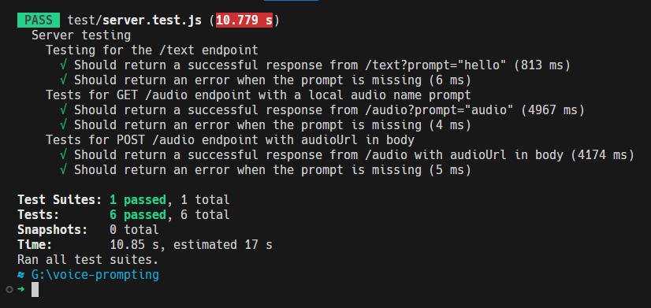

# Voice Prompting

Api with two functionalities,
1. Send a prompt to some language model in OpenAI and show the response it returns.
2. Take an audio example (.mp3 ) as a file, read it in the program and transcribe it to text (Spanish) and use the transcription as a prompt to an OpenAI language model.

## Get start

1. Clone the repository or download the source code.
2. Run the following command to install the dependencies:

```bash
# install dependencies
npm install
# run server
npm start
# test
npm test
```
## Config

Before running the application, be sure to configure the following:

environment variables, also you have the example.env in the repository

```
PORT=3000
OPENAI_ORGANIZATION=org-....oPY
OPENAI_API_KEY=ss....EXgUhjIY
```

## Endpoints

### GET: /text

Send query prompt.
- query prompt="text"

> GET localhost:3000/text?prompt=hola

```json
{
  "answer": "¡Hola! ¿En qué puedo ayudarte hoy?"
}
```

### GET: /audio 

Traslate and send as prompt.
- query prompt="audio-name"

example:

> GET localhost:3000/audio?prompt=audio

```json
{
  "traslation": "Carreras más demandadas de la actualidad y descripción de cada una de ellas.",
  "answer": "Algunas de las carreras más demandadas de la actualidad son:\n\n1. Ciencia de datos: esta carrera se enfoca en reunir, analizar y comprender grandes conjuntos de datos mediante herramientas tecnológicas para solucionar problemas empresariales.\n\n2. Inteligencia Artificial: esta carrera se centra en crear sistemas y programas que pueden realizar tareas que requerirían la inteligencia humana como el razonamiento, el aprendizaje y la percepción.\n\n3. Ciberseguridad: se trata de proteger la información digital importante de ataques maliciosos.\n\n4. Ingeniería de software: enfocada en el diseño, desarrollo y mantenimiento de sistemas de software.\n\n5. Medicina: La medicina y la salud son carreras importantes y siempre estarán en demanda. \n\nEstas carreras tienen una demanda creciente y están bien remuneradas, sin embargo, es importante elegir una carrera que te apasione y que esté en línea con tus intereses y habilidades."
}
```
### POST: /audio

Traslate and send as prompt a URL stream audio.

example:

> POST localhost:3000/audio
- example request body

```json
{
  "audioUrl": "https://www...com/audio.mp3"
}
```

## Tests performed

